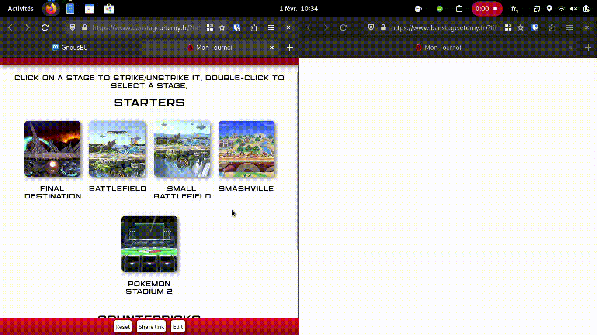
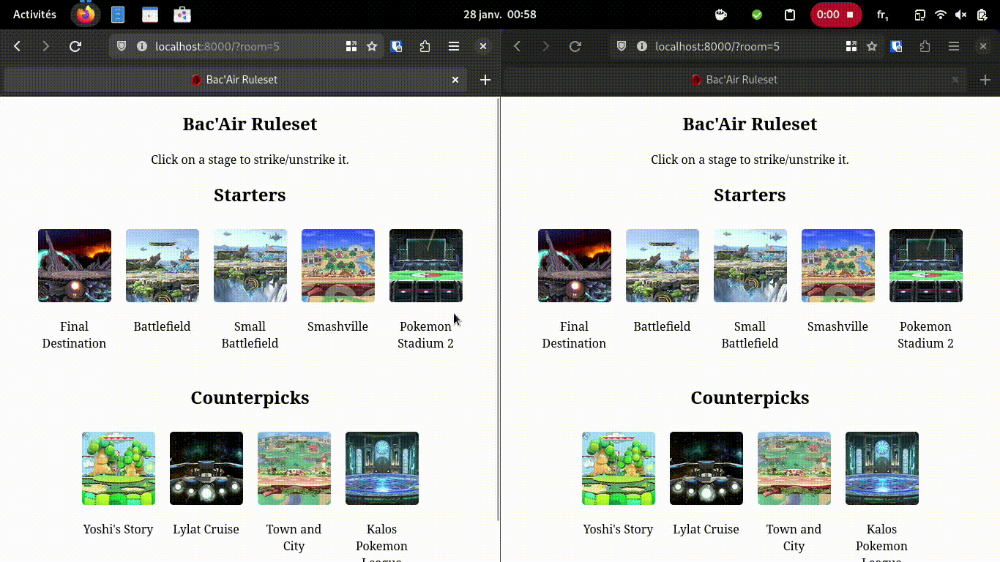

# Eterny BanStages

Une application web pour choisir un terrain pour jouer en compétition sur « Super Smash Bros Ultimate ».
L'application propose :
- Possibilité de « bannir » des stages (les griser) en cliquant dessus
- Selection d'un stage en double cliquant dessus
- Synchronisation des écrans de plusieurs appareils pour des joueurs « online » ou pour afficher la selection sur un stream
- Mode « stream » pour afficher temporairement les stages « banni » et avec un fond transparent pour utiliser avec OBS (utiliser un site web comme source)

## fonctionnement de l’app:

- lancer le websocket-server (node websocket-server.js)
- lancer le server web (par exemple python -m http.server)
- se connecter à la page web en utilisant l’url (ne pas utiliser file://…)

IMPORTANT: le websocket-server doit être accessible via la même ip que le serveur web
le port 6000 doit être disponible. Sinon modifier le client.js et websocket-server.js pour changer.
(c’est cette ip qui sera utilisée pour établir la connection.)

## api websocket:

les informations sont partagées entre les pages d’une même room via une websocket. Les messages sont tous
de la forme d’un objet JSON:

exemple :

let req = {
  "room": room,
  "code": 2,
  "value": id
};

- room = room dans laquelle est la page actuelle (permet de synchroniser les clients d’une même room)
         (le serveur va renvoyer le message à tous les clients de la room, y compris l’envoyeur)
- code = opération à exécuter.
- value = une valeur. Dépend de l’événement choisi

Liste des opérations:

code = 0: choisir une room, value contient le numéro de la nouvelle room
          la room 0 est interdite. si on demande la room 0, une room vide alatoire sera attribuée.
          si on demande un autre événement avec la room 0, il ne sera pas partagé aux autres clients.
code = 1: ban un stage, value contient l’id du stage (l’id est relatif à la position sur la page)
code = 2: unban un stage, similaire à précédemment
code = 3: demander à renvoyer la totalité des infos de la page (stages choisis, titre du tournoi,
          stages ban et unban)
          (permet de synchroniser les client si l’un d’entre eux perd se reconnecte)
code = 4: changer la selection des stages, value contient un string avec que des lettres (Maj et min),
          les lettres minuscules correspondent aux id des stages de base, les majuscules aux counterpicks
          les stages avec des id élevés s’écrivent "0a3B4e" en rajoutant un chiffre devant la lettre.
code = 5: changer le nom de l’évenement, value contient un string, le nouveau titre
